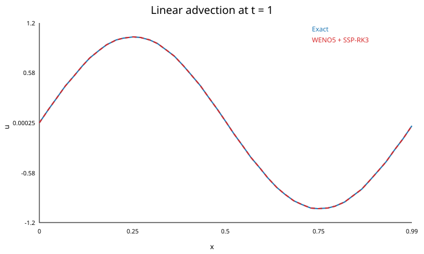
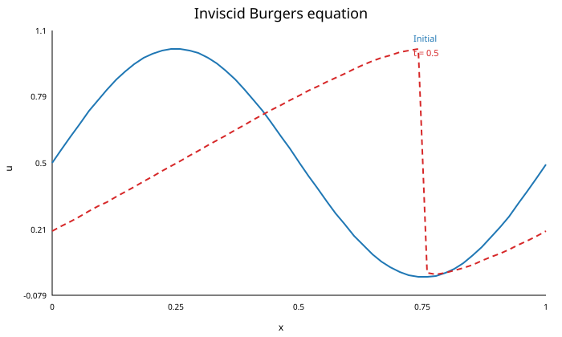
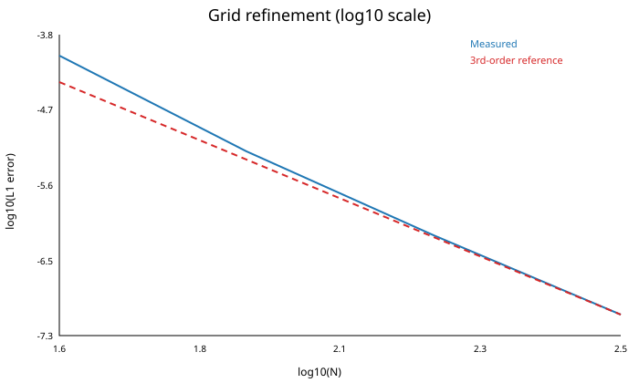

# ENO/WENO Schemes for Conservation Laws

A compact research-and-teaching repository for **high-resolution numerical methods for one-dimensional hyperbolic conservation laws**.

The repository now contains two complementary parts:

1. a LaTeX presentation introducing ENO/WENO ideas for conservation laws and Riemann problems; and
2. a tested Python implementation of **fifth-order WENO (WENO-JS)** with global Lax-Friedrichs flux splitting and **third-order SSP Runge-Kutta (SSP-RK3)** time stepping.

The code is intentionally small and readable so that the numerical method can be inspected, modified, and extended for research or teaching.

## Mathematical problem

We consider scalar conservation laws

\[
u_t + f(u)_x = 0
\]

on a periodic one-dimensional domain.

The semidiscrete conservative scheme has the form

\[
\frac{d u_i}{dt}
=
-\frac{1}{\Delta x}
\left(
\hat f_{i+1/2}-\hat f_{i-1/2}
\right),
\]

where the interface fluxes are reconstructed with fifth-order WENO.

For nonlinear fluxes, the implementation uses global Lax-Friedrichs splitting

\[
f^\pm(u)
=
\frac12\left(f(u)\pm \alpha u\right),
\qquad
\alpha = \max |f'(u)|.
\]

The positive and negative split fluxes are reconstructed from their appropriate upwind directions and combined at each interface.

## Numerical method

The implementation includes:

- classical Jiang-Shu WENO5 reconstruction;
- three third-order candidate polynomials;
- Jiang-Shu smoothness indicators;
- nonlinear WENO weights with ideal weights \(1/10,\,6/10,\,3/10\);
- global Lax-Friedrichs flux splitting;
- conservative flux differencing;
- adaptive CFL-based time stepping;
- third-order SSP Runge-Kutta integration;
- periodic boundary conditions;
- L1, L2, and Linf error utilities;
- observed convergence-order calculation.

## Test problems

### 1. Smooth linear advection

\[
u_t + u_x = 0,
\qquad
u(x,0)=\sin(2\pi x).
\]

After one full period, the exact solution returns to the initial profile. This makes the problem useful for error and convergence studies.



For \(N=200\), \(t=1\), and CFL \(=0.4\):

- L1 error: `3.45007299e-07`
- Linf error: `5.43318761e-07`

### 2. Inviscid Burgers equation

\[
u_t + \left(\frac{u^2}{2}\right)_x = 0,
\]

with smooth periodic initial data

\[
u(x,0)=\frac12+\frac12\sin(2\pi x).
\]

The solution steepens nonlinearly and develops a sharp front. The conservative discretization preserves total mass to roundoff accuracy.



For \(N=400\), \(t=0.5\), and CFL \(=0.35\), the measured mass change is approximately

`-1.72e-14`.

## Grid-refinement study

The smooth linear-advection example gives the following fully discrete L1 errors:

| N | L1 error | observed order |
|---:|---:|---:|
| 40 | 8.58907845e-05 | - |
| 80 | 6.56116358e-06 | 3.710 |
| 160 | 6.89533105e-07 | 3.250 |
| 320 | 8.21050906e-08 | 3.070 |



The spatial reconstruction is fifth-order WENO, while the time integrator is third-order SSP-RK3. With `dt` proportional to `dx`, the asymptotic **fully discrete** convergence therefore approaches third order, as expected.

A permanent copy of the table and interpretation is available in [`results/convergence.md`](results/convergence.md).

## Repository structure

```text
.
├── README.md
├── main.tex
├── references.bib
├── requirements.txt
├── CITATION.cff
├── weno/
│   ├── __init__.py
│   ├── core.py
│   ├── diagnostics.py
│   └── problems.py
├── examples/
│   ├── linear_advection.py
│   ├── burgers.py
│   └── convergence.py
├── tests/
│   └── test_solver.py
├── figures/
│   ├── linear_advection.svg
│   ├── burgers.svg
│   └── convergence.svg
└── results/
    └── convergence.md
```

## Installation

Clone the repository and install the dependencies:

```bash
git clone https://github.com/abdulrab/ENO-WENO-Schemes-for-Conservation-Laws.git
cd ENO-WENO-Schemes-for-Conservation-Laws
python -m pip install -r requirements.txt
```

The implementation requires only NumPy for the solver. Matplotlib is used by the example scripts to generate figures, and pytest is used for automated tests.

## Run the examples

From the repository root:

```bash
python examples/linear_advection.py
python examples/burgers.py
python examples/convergence.py
```

The scripts print quantitative diagnostics and regenerate the SVG figures in `figures/`.

## Run the tests

```bash
python -m pytest -q
```

The tests check:

- exact preservation of a constant state;
- conservative mass preservation on a periodic grid;
- reduction of linear-advection error under grid refinement;
- correctness of the error and observed-order utilities.

A GitHub Actions workflow also runs the test suite automatically on pushes and pull requests.

## Code example

```python
import numpy as np

from weno import linear_advection, solve_periodic

flux, speed = linear_advection(a=1.0)

solution = solve_periodic(
    initial_condition=lambda x: np.sin(2.0 * np.pi * x),
    flux=flux,
    max_characteristic_speed=speed,
    n=200,
    t_final=1.0,
    cfl=0.4,
)

print(solution.u)
```

## Presentation

`main.tex` contains the accompanying academic presentation on ENO/WENO methods, including:

- hyperbolic conservation laws;
- Riemann problems;
- ENO stencil selection;
- WENO candidate reconstructions;
- Jiang-Shu smoothness indicators;
- nonlinear weights;
- numerical fluxes;
- SSP-RK3 time integration;
- CFL considerations;
- suggested benchmark problems.

Compile it with a standard LaTeX installation, for example:

```bash
pdflatex main.tex
bibtex main
pdflatex main.tex
pdflatex main.tex
```

## Current scope and limitations

This code is an educational/research prototype for **scalar one-dimensional conservation laws with periodic boundary conditions**. It is not yet a general solver for systems such as the Euler equations or two-phase-flow models.

Natural next steps include:

- characteristic-wise WENO reconstruction for systems;
- exact and approximate Riemann solvers;
- non-periodic boundary conditions;
- WENO-Z and mapped WENO variants;
- finite-volume formulations;
- Euler and shallow-water equations;
- two-phase hyperbolic systems;
- multidimensional extensions;
- systematic comparisons with ENO, TVD, MUSCL, and other shock-capturing methods.

## References

The theoretical presentation is based principally on:

- A. Harten, B. Engquist, S. Osher, and S. R. Chakravarthy, *Uniformly High Order Accurate Essentially Non-Oscillatory Schemes, III*.
- C.-W. Shu, *Essentially Non-Oscillatory and Weighted Essentially Non-Oscillatory Schemes*, Acta Numerica, 2020.
- Additional references are listed in [`references.bib`](references.bib).

## Author

**Abdul Rab**  
Lecturer in Mathematics  
Research interests: numerical analysis, numerical PDEs, hyperbolic conservation laws, Riemann problems, and scientific computing.

Academic portfolio: https://abdulrab.github.io/
